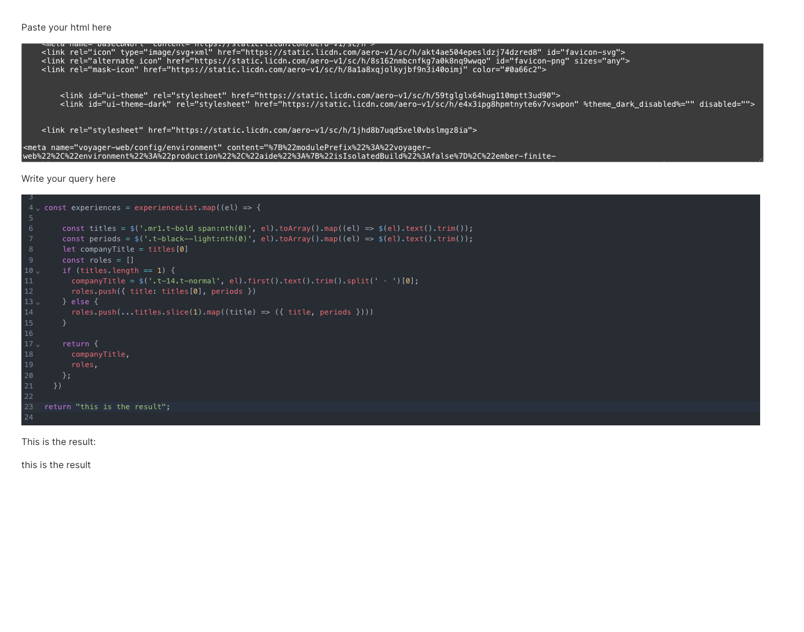

# Cheerio Live Tester

This scrappy tool allows you to paste some html and write javascript with cheerio to see the outputs live.

It can help you build scrapers much faster than having to rerun your parser in other ways.



## Running

```shell
yarn install
yarn dev
```